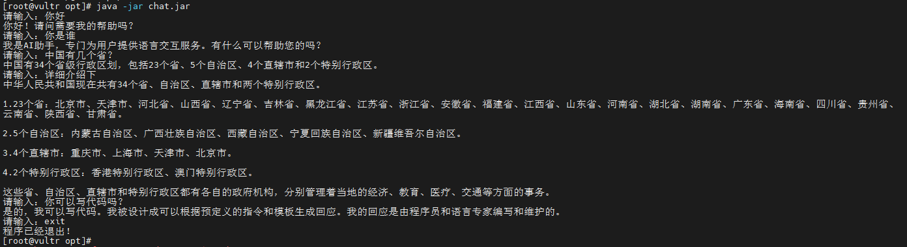
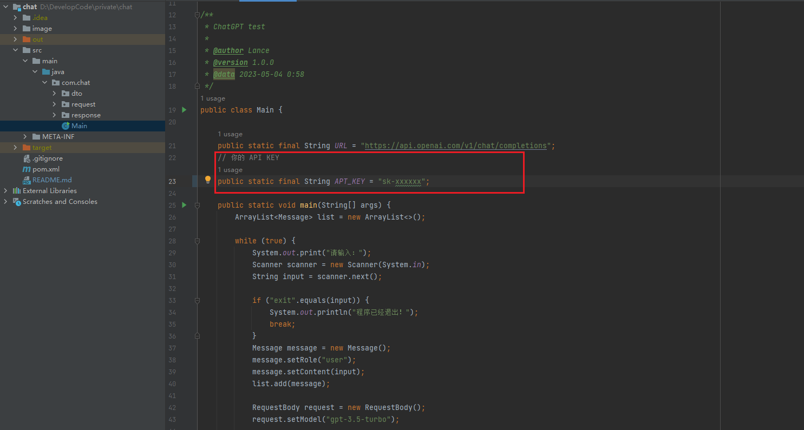
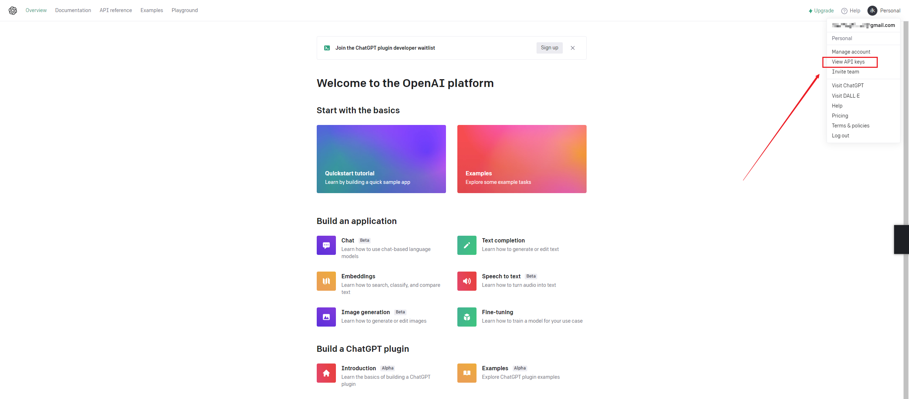

# chat

#### 介绍
简单使用open AI 对话

#### 运行效果

软件架构说明


#### 项目配置
1. 需要你自己 ChatGPT 账号的 API KYE 获取地址：https://platform.openai.com/
2. 在 Main.java 中配置即可
3. 点击右上角的 View API keys 
4. 如果没有的话去创建一个自己的 key

#### 使用说明
1. 需海外服务器安装 JDK 版本1.8
```shell
yum install -y java-1.8.0-openjdk.x86_64
```
2. 项目打包后在 `out` 目录下找到 `jar` 文件上传至服务器即可
3. 启动项目
```shell
java -jar chat.jar
```
